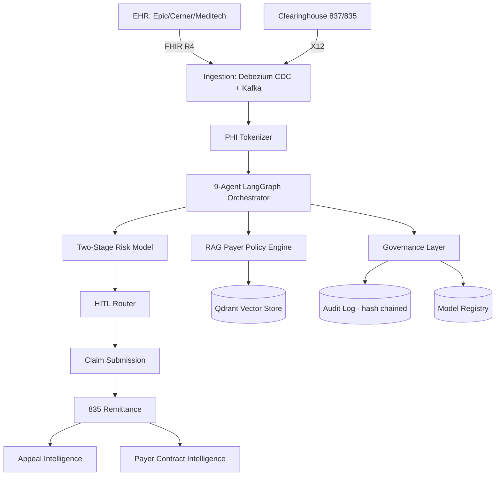

# Full Architecture (private/internal detail level)

See `denialiq-public/diagrams/architecture.md` for the shareable version.
This file is for internal notes on production-only wiring — e.g. exact
Kafka topic names, Qdrant collection names per client, and model registry
promotion flow — fill in as the system matures.

